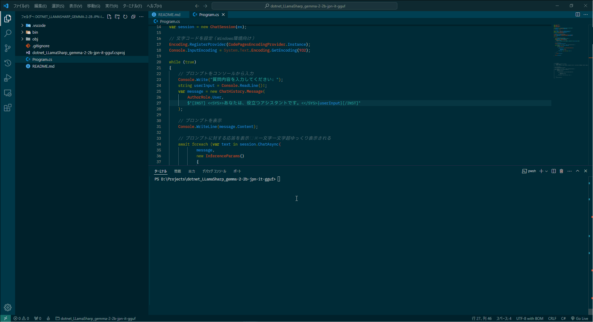

# dotnet_LLamaSharp_gemma-2-2b-jpn-it-gguf

## 概要
* 日本語版 Gemma 2 2B を .NET の LLamaSharp で試してみる
* 試したのは一番小さい gemma-2-2B-jpn-it-IQ4_XS.gguf ※約 1.5 GB

日本語版 Gemma 2 2B を公開  
https://blog.google/intl/ja-jp/company-news/technology/gemma-2-2b/  

Hugging Face - grapevine-AI/gemma-2-2b-jpn-it-gguf  
https://huggingface.co/grapevine-AI/gemma-2-2b-jpn-it-gguf/tree/main  
gemma-2-2B-jpn-it-IQ4_XS.gguf  

## 結果
* すげぇええええええ！！！！
* ちょっとだけおかしい日本語もあるけど、ほぼ完ぺきだし、これを 2B の Q4 で回答できるのはやばすぎる。。。回答も早いし。。。
* AI の進化やばいな。これだけ軽量でこの性能ならローカルのアプリに乗せられるかもしれん

## 詳細

```
dotnet new console
dotnet add package LLamaSharp --version 0.16.0
dotnet add package LLamaSharp.Backend.Cpu --version 0.16.0
```

gemma-2-2B-jpn-it-IQ4_XS.gguf をダウンロードし C:\models に配置

```
dotnet run
```

実行結果　※等速  


# 以下、AI による回答（上記画像のやつ）

## 質問
WebAssembly について子供でもわかるように解説してください。

## 回答

## WebAssembly: ゲームやアプリを楽しむための超高速エンジン！

**WebAssembly (Wasm)** は、Webブラウザ上で動くプログラムのことです！  
ゲームやアプリを動かすためのエンジンで、高速で効率的に動作します！ 

**簡単に言うと…**  
パソコンで使うようなゲームやアプリのエンジンを、ブラウザ上で動かせるようになります！ 

できます。
* **軽量:**  ブラウザに余分なものを不要にするので、快適に利用できます。
* **多様な機能:**  様々な種類のゲームやアプリに対応できます。

**例えば…**
* **ゲーム:**  高速でリアルなゲームやアニメーションを実現できます。
* **動画:**  高画質の動画を高速で再生できます。
* **画像処理:**  画像を処理して、効果やアニメーションを追加できます。


**メリット**

* **新しい技術:**  Webの進化と、新しい技術の融合によって、新しい可能性が生まれます。
* **多様なアプリケーション:**  様々なアプリケーションに対応できます。
* **高速化:**  従来の技術ではできなかった高速化を実現できます。


**これから**
WebAssemblyはまだまだ新しい技術です。
ゲームやアプリの世界を変えるような可能性を秘めています！
